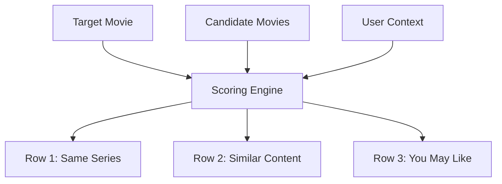

# Go Recommender

A high-performance, dependency-free movie recommendation engine written in Go.

It implements custom heuristic matching and personalization algorithms designed for media discovery systems.

## Features

- **Franchise & Sequel Detection**: Automatically extracts and normalizes franchise name roots in English and Vietnamese, handling part numbers, season numbers, and spin-off titles.
- **Content Similarity Scoring**: Computes content relevance based on actor, director, and genre overlap, with format-aware filtering (e.g. keeping anime/animation separated from live-action films).
- **Personalized Recommendations**: Incorporates user-specific genre affinity scores, collaborative filtering (co-watched items), and temporal decay scoring (recent views carry more weight).
- **Edge-Case Resolution**: Specially tuned rules to prevent false-positives on generic title roots (e.g. "love", "revenge", "war", "spider-man") while preserving correct matching for single-token franchises (e.g. "Larva", "Bleach").

## Architecture

The engine scores and splits candidate movies into three recommendation rows:



1. **Same Series**: Identifies movies in the same franchise/universe (Score >= 10), sorted chronologically by release year and part/season number.
2. **Similar Content**: Non-franchise movies matching similar themes, format, and genres (Score > 0).
3. **You May Like**: Personalized suggestions based on the user's genre preferences and co-watch data, filtering out already watched films.

## Usage

```go
package main

import (
	"fmt"
	"github.com/sunnyone/go-recommender"
)

func main() {
	target := recommender.Movie{
		ID:         "1",
		Slug:       "nguoi-nhen-du-hanh-vu-tru-nhen",
		Name:       "Người Nhện: Du Hành Vũ Trụ Nhện",
		OriginName: "Spider-Man: Across the Spider-Verse",
		Year:       2023,
		Actors:     []string{"Shameik Moore", "Hailee Steinfeld"},
		Directors:  []string{"Joaquim Dos Santos"},
		Genres:     []string{"hoat-hinh", "hanh-dong"},
	}

	candidates := []recommender.Movie{
		{
			ID:         "2",
			Slug:       "nguoi-nhen-vu-tru-moi",
			Name:       "Người Nhện: Vũ Trụ Mới",
			OriginName: "Spider-Man: Into the Spider-Verse",
			Year:       2018,
			Actors:     []string{"Shameik Moore", "Jake Johnson"},
			Directors:  []string{"Bob Persichetti"},
			Genres:     []string{"hoat-hinh", "hanh-dong"},
		},
	}

	ctx := recommender.UserContext{
		GenreScores:     map[string]float64{"hoat-hinh": 1.5},
		CoWatchedMovies: map[string]bool{},
		RecentGenres:    map[string]int{"hoat-hinh": 1},
		WatchedMovies:   map[string]bool{},
	}

	res := recommender.Recommend(target, candidates, ctx)
	fmt.Printf("Same series count: %d\n", len(res.SameSeries))
}
```

## Testing

Run unit tests:
```bash
go test -v ./...
```
